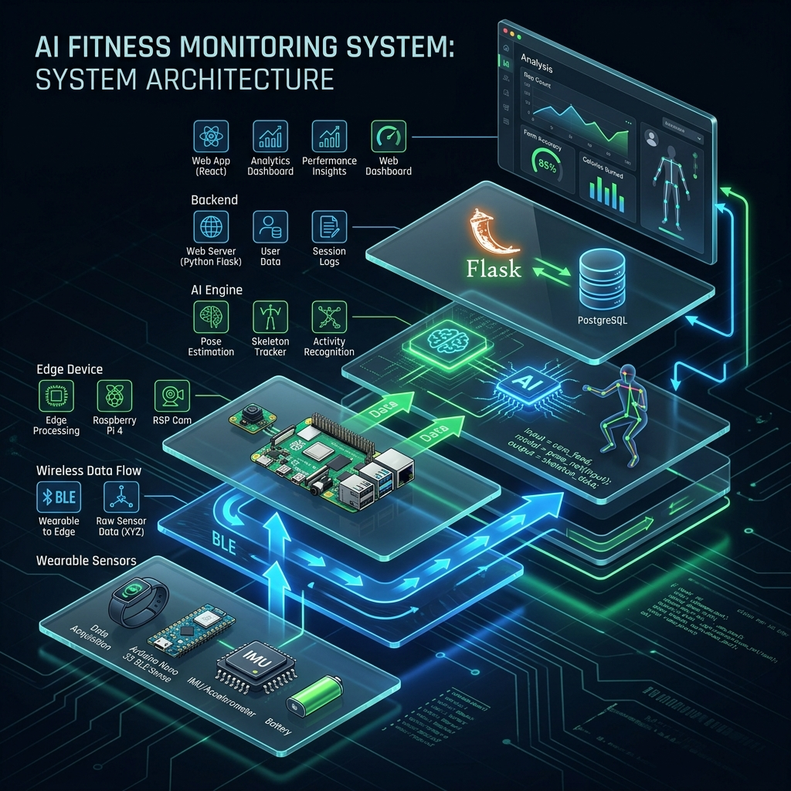

# System Architecture: AI Fitness Monitoring System

This document outlines the high-level architecture of the **NeuronFit** platform, a multi-layered IoT and AI solution for professional fitness tracking.

## 3D Architecture Overview

---

## 🏗️ Architectural Layers

### 1. Wearable Sensor Layer (Data Acquisition)
*   **Hardware**: Arduino Nano 33 BLE Sense.
*   **Sensors**: On-board IMU (LSM9DS1) providing 3-axis Accelerometer and Gyroscope data.
*   **Function**: Captures body orientation and movement velocity at the hardware level.

### 2. Communication Layer (Wireless Link)
*   **Protocol**: Bluetooth Low Energy (BLE) 5.0.
*   **Data Stream**: Real-time transmission of sensor packets to the edge gateway.

### 3. Edge Gateway Layer
*   **Hardware**: Raspberry Pi / Local Host.
*   **Visual Input**: High-speed camera feed for secondary spatial verification.
*   **Function**: Orchestrates data from both wearable sensors and computer vision.

### 4. AI Processing Layer (Intelligence Engine)
*   **Pose Estimation**: MediaPipe Pose Landmarker for 33 skeletal keypoint tracking.
*   **Biomechanics**: Custom geometric logic for angle calculation (Knee, Hip, Shoulder).
*   **Logic**: Real-time repetition counting and form quality scoring.

### 5. Backend Layer
*   **Framework**: Flask (Python).
*   **Persistence**: SQLite (User Sessions) & JSON (Event Logging).
*   **Security**: Bcrypt password hashing and Signed Cookie session management.

### 6. Application Layer (User Experience)
*   **Frontend**: React.js SPA with Tailwind CSS.
*   **Analytics**: Recharts-based performance visualization.
*   **Feedback**: Real-time coaching voice synthesis.

---

*© 2026 NeuronFit AI Intelligence Systems*
